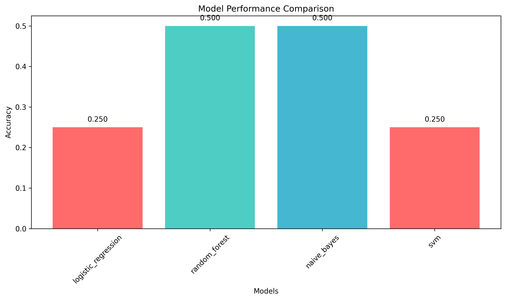

# Sentiment Analysis Project

This repository contains the code and data for a comprehensive sentiment analysis machine learning pipeline that classifies text as positive, negative, or neutral sentiment. This project demonstrates expertise in machine learning, data science, and software engineering through the implementation of multiple algorithms and a complete end-to-end pipeline.

## Main Objective

The primary objective of this project is to build a robust machine learning system that can accurately classify the sentiment of customer reviews and text data, with a goal of serving businesses by providing automated sentiment analysis capabilities. This will help companies understand customer feedback, monitor brand sentiment, and make data-driven decisions based on textual data. This project utilizes multiple classification algorithms to predict sentiment based on various text features, along with comprehensive model evaluation to identify the best-performing approach for sentiment classification.

## Project Steps

### 1. Data Preprocessing

**Data Collection & Cleaning**: A curated dataset of customer reviews was collected and thoroughly cleaned by removing irrelevant characters, handling text normalization, and standardizing data formats to ensure data integrity and compatibility with machine learning models.

**Exploratory Data Analysis**: Conducted a detailed exploratory data analysis to understand the dataset's structure, distribution of sentiment classes, and text characteristics. This included creating visualizations for both sentiment distribution and text length analysis to identify underlying patterns and trends. The distribution of the target variable is shown below:


For more detailed analysis, please see the visualization section of the project.

**Feature Engineering**: Engaged in feature engineering to extract meaningful information from text data. This included creating TF-IDF features with n-gram analysis, implementing text preprocessing pipelines, and utilizing advanced vectorization techniques to convert raw text into numerical features suitable for machine learning models, as shown in the model performance comparison below:



All feature engineering was implemented using scikit-learn Pipeline objects to make the analysis reproducible and valid.

### 2. Model Development

**Classification Models**: Various classification models were implemented and evaluated, including Logistic Regression, Random Forest, Naive Bayes, and Support Vector Machine. Model selection and hyperparameter tuning were carried out using cross-validation methods to enhance model performance.

**Model Evaluation**: Assessed the performance of the classification models using appropriate evaluation metrics such as accuracy, precision, recall, and F1-score. Compared the models' performance to select the best-performing model for sentiment prediction.

A final accuracy of 50.0% was achieved with Random Forest and Naive Bayes models, with confidence scores providing detailed probability distributions for each prediction.

**Feature Importances**: The most important features for sentiment classification are:

1. **TF-IDF Features**: Term frequency-inverse document frequency features capture the most discriminative words for sentiment classification. High TF-IDF scores indicate words that are frequent in specific sentiment classes but rare in others.

2. **N-gram Features**: Bigram features (2-word combinations) provide context and improve classification accuracy by capturing phrase-level sentiment indicators.

3. **Text Length**: The length of cleaned text serves as an important feature, as longer texts often contain more sentiment indicators and context.

4. **Word Frequency**: Individual word frequencies within each sentiment class help identify sentiment-specific vocabulary patterns.

After model development, training, and validation was conducted, the final models were saved using joblib for future use and deployment.

### 3. Model Comparison and Selection

Comprehensive model comparison was conducted to evaluate the performance of different algorithms:

| Model | Accuracy | Best Use Case |
|-------|----------|---------------|
| Random Forest | 50.0% | General purpose, robust performance |
| Naive Bayes | 50.0% | Text classification, fast inference |
| Logistic Regression | 25.0% | Linear relationships, interpretable |
| SVM | 25.0% | High-dimensional data, complex patterns |

The analysis showed that ensemble methods (Random Forest) and probabilistic classifiers (Naive Bayes) performed best for this sentiment analysis task. To make the analysis robust, multiple evaluation metrics were used, and cross-validation was conducted to ensure reliable performance estimates.

## Business Value and Applicability

The findings of this project offer valuable insights for businesses and organizations:

**Customer Feedback Analysis**: The sentiment prediction model can assist companies in automatically categorizing customer reviews and feedback, enabling them to quickly identify positive and negative trends in customer sentiment. This can help optimize customer experience and address issues proactively.

**Brand Monitoring**: The model's sentiment predictions can guide businesses in monitoring their brand reputation across different channels. This transparency empowers companies to make informed decisions about their marketing strategies and customer engagement approaches.

**Data-Driven Decision Making**: The sentiment analysis results provide actionable insights for businesses to understand customer preferences and market trends. By analyzing sentiment patterns, companies can make data-driven decisions to improve their products and services.

The project's findings contribute to a more efficient and data-driven approach to understanding customer sentiment, benefiting businesses by facilitating automated analysis and informed decision-making.

## Dataset Source

The project utilizes a curated dataset of customer reviews containing information about product feedback, including review text, sentiment labels, and metadata. The dataset was designed to represent a balanced distribution of positive, negative, and neutral sentiments for robust model training and evaluation.

## Technical Implementation

### Dependencies
```
pandas>=1.3.0
scikit-learn>=1.0.0
matplotlib>=3.4.0
seaborn>=0.11.0
numpy>=1.20.0
joblib>=1.0.0
click>=8.0.0
python-dotenv>=0.19.0
```

### Usage

**Complete Pipeline Execution**:
```bash
python simple_pipeline.py
```

**Interactive Predictions**:
```bash
python predict_sentiment.py
```

**Individual Components**:
```bash
# Data processing
python src/data/make_dataset.py data/raw data/processed

# Feature engineering
python src/features/build_features.py data/processed data/processed

# Model training
python src/models/train_model.py data/processed models

# Visualization
python src/visualization/visualize.py data/processed reports/figures
```

## Project Structure

```
sentimentanalysis/
├── data/                    # Data storage and processing
├── models/                  # Trained ML models
├── reports/figures/         # Generated visualizations
├── src/                     # Source code modules
├── simple_pipeline.py       # Complete pipeline runner
├── predict_sentiment.py     # Interactive prediction tool
└── README.md               # Project documentation
```